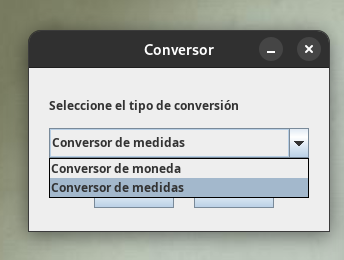
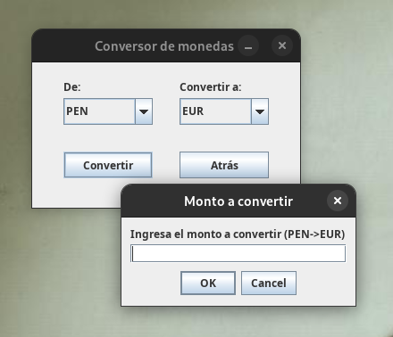
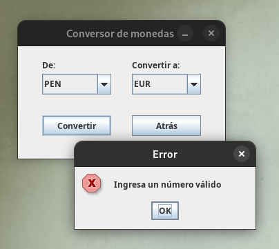
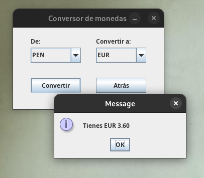

# Proyecto Conversor
Proyecto de challenge de la ruta backend con Java en Alura.

### Funcionalidades:
- Conversor de monedas (PEN, USD, EUR, MXN, COP)
- Conversor de medidas (CM, M, KM)

### Compilar y ejecutar el programa
```bash
# Ingresar a la carpeta del proyecto
cd carpeta-del-proyecto/src

# Compilar el código
javac Converter.java

# Ejecutar el programa
java Converter
```

### Capturas









<hr />

Cualquier duda o consulta ponerse en contacto por [aquí](https://linkedin.com/in/jhonachata)

> Desarrollado por [Jhon Achata](https://linkedin.com/in/jhonachata)